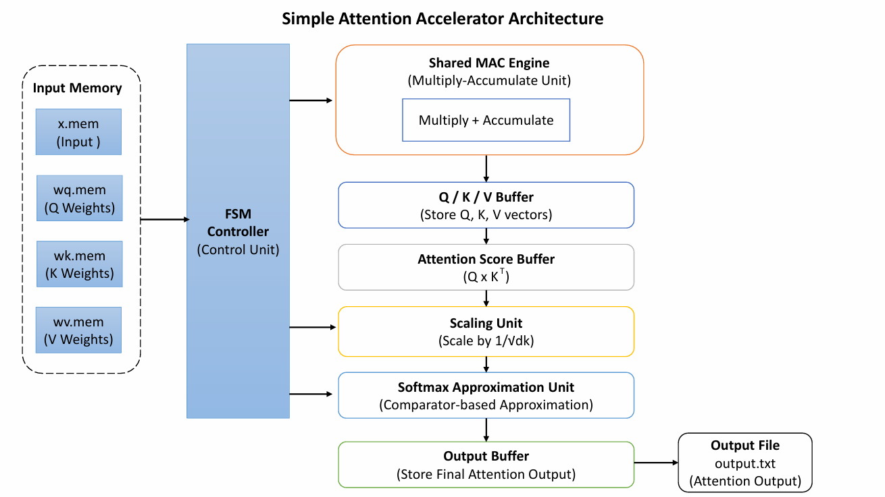

# Simple Attention Accelerator

Hardware implementation of a simplified scaled dot-product attention mechanism using **Verilog/SystemVerilog**.

---

# Overview

This project implements a simplified scaled dot-product attention mechanism in Verilog/SystemVerilog. The design computes **Query (Q)**, **Key (K)**, and **Value (V)** matrices from input tokens and learned weight matrices, calculates attention scores, applies scaling and a hardware-friendly softmax approximation, and generates the final attention output.

The objective is to demonstrate how transformer attention operations can be mapped onto an efficient hardware architecture while balancing hardware complexity, latency, and resource utilization.

---

# Attention Equation

```text
Attention(Q,K,V) = softmax(QKᵀ / √dk)V
```

---

# Architecture

Unlike a fully parallel implementation, this design uses a **shared Multiply-Accumulate (MAC) engine** controlled by a **Finite State Machine (FSM)**.



The same MAC engine is reused throughout the attention pipeline, significantly reducing hardware resource utilization while increasing execution latency.

---

# Design Decisions

## Shared MAC Architecture

A single MAC unit is reused to compute:

- Query (Q)
- Key (K)
- Value (V)
- Attention Scores (QKᵀ)
- Final Output

### Advantages

- Lower hardware area
- Reduced resource utilization
- Simpler hardware implementation

### Disadvantages

- Higher execution latency
- Lower throughput than fully parallel architectures

---

## Number Representation

The design uses integer arithmetic for simplicity and ease of verification.

---

## Scaling Strategy

For this implementation:

- dk = 4
- √dk = 2

Scaling is implemented using a simple divide-by-2 operation.

---

## Softmax Approximation

Instead of implementing expensive exponential functions, a simple comparator-based approximation is used.


Example:

```text
If Score1 > Score2

Attention = [0.75, 0.25]

Else

Attention = [0.25, 0.75]
```


# FSM Control Flow

```text
IDLE
 ↓
LOAD_DATA
 ↓
COMPUTE_Q
 ↓
COMPUTE_K
 ↓
COMPUTE_V
 ↓
COMPUTE_SCORE
 ↓
SCALE_SCORE
 ↓
SOFTMAX
 ↓
COMPUTE_OUTPUT
 ↓
WRITE_OUTPUT
 ↓
DONE

```
# Project Structure

```text
simple-attention-accelerator/
│
├── src/
│   └── attention_top.v
│
├── tb/
│   └── tb_attention.v
│
├── data/
│   ├── x.mem
│   ├── wq.mem
│   ├── wk.mem
│   └── wv.mem
│
├── scripts/
│   └── verify.py
│
├── docs/
│   ├── architecture.png
│   └── design_decisions.md
│
└── README.md
```
## Input Files

The design reads all input matrices from text files using Verilog file I/O.

Files:

- x.mem
- wq.mem
- wk.mem
- wv.mem

# Simulation Environment

## Tools

- Icarus Verilog
- GTKWave
- Python 3
- NumPy

## Compile

```bash
iverilog -o sim tb/tb_attention.v src/attention_top.v
```

## Run

```bash
vvp sim
```

## Open Waveform

```bash
gtkwave attention.vcd
```

---

# Verification

A Python reference implementation (`scripts/verify.py`) is provided to validate the hardware implementation.

The verification compares:

```text
Python Reference Output
          │
          ▼
Verilog Hardware Output
```

Both implementations produce identical outputs for the provided test case.

---

# Trade-Off Analysis

| Design Choice | Benefit | Cost |
|---|---|---|
| Shared MAC Engine | Lower hardware area | Higher latency |
| Fixed-Point Arithmetic | Lower hardware complexity | Reduced numerical precision |
| Sequential Execution | Simpler implementation | Lower throughput |
| Approximate Softmax | Lower computational cost | Less accurate than exact softmax |

## Author

**Md Wajih Tousif Raafi**
